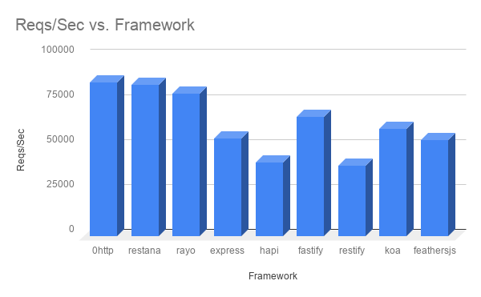

# Introduction
[](https://www.npmjs.com/package/0http)
[](https://www.npmjs.com/package/0http)
[](https://www.npmjs.com/package/0http)
[](https://www.npmjs.com/package/0http)
[](https://github.com/jkyberneees/0http)

  

Zero friction HTTP framework:
- Tweaked Node.js HTTP server for high throughput.
- High-performance and customizable request routers. 



> Check it yourself: https://web-frameworks-benchmark.netlify.app/result?f=feathersjs,0http,koa,fastify,nestjs-express,express,sails,nestjs-fastify,restana

## Installation

Install the package from npm:

```bash
npm install 0http
```

## Usage
```js
const cero = require('0http')
const { router, server } = cero()

router.get('/hello', (req, res) => {
  res.end('Hello World!')
})

router.post('/do', (req, res) => {
  // ...
  res.statusCode = 201
  res.end()
})

//...

server.listen(3000)
```

# Support / Donate 💚
You can support the maintenance of this project: 
- PayPal: https://www.paypal.me/kyberneees

# Security notes

- **Errors never crash the process.** A route handler that throws (or rejects)
  after response headers are already sent is contained: the response is ended or
  the socket closed, and the server keeps serving. A custom `errorHandler` that
  itself throws or rejects is also contained with a bare `500`.
- **Route matching is case-insensitive.** `/Admin`, `/admin` and `/ADMIN` all
  match a route registered as `/admin`. Reverse proxies, WAFs and auth layers
  that classify paths case-sensitively must be aligned accordingly.
- **Mount nested routers with `use()`.** Only `router.use(prefix, subRouter)`
  rewrites the URL when entering a nested router. A router passed to `get()` or
  `on()` is treated as a plain middleware and will not match its sub-routes.
- **Nested routers own unmatched requests.** If a mounted router finds no route
  for the rewritten URL, it responds `404` itself and the parent chain is not
  resumed (unlike Express mounted apps, which fall through).
- **The route cache is memory-bounded.** Matches with parameters, `404`s, and
  paths longer than 4KB are never cached, and the cache is additionally capped
  by total size — so attacker-controlled unique paths cannot pin memory.

# More
- Website and documentation: https://0http.21no.de
