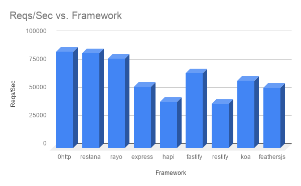

# Introduction
[](https://www.npmjs.com/package/0http)
[](https://www.npmjs.com/package/0http)
[](https://www.npmjs.com/package/0http)
[](https://www.npmjs.com/package/0http)
[](https://github.com/jkyberneees/0http)

  

Zero friction HTTP framework:
- Tweaked Node.js HTTP server for high throughput.
- High-performance and customizable request routers. 



> Check it yourself: https://web-frameworks-benchmark.netlify.app/result?f=feathersjs,0http,koa,fastify,nestjs-express,express,sails,nestjs-fastify,restana

## Installation

Install the package from npm:

```bash
npm install 0http
```

## Usage
```js
const cero = require('0http')
const { router, server } = cero()

router.get('/hello', (req, res) => {
  res.end('Hello World!')
})

router.post('/do', (req, res) => {
  // ...
  res.statusCode = 201
  res.end()
})

//...

server.listen(3000)
```

### Trie router (dependency-free, fastest)
A segment-trie router with the same API, middleware chaining, nested routers
and error containment as the default sequential router, but no regex per route,
no route cache to size, and no external dependencies. Static routes resolve in
constant time and dynamic routes stay flat as the route count grows.

```js
const trie = require('0http/lib/router/trie')
const { router, server } = cero({ router: trie() })

router.use((req, res, next) => next())
router.get('/users/:id', (req, res) => res.end(req.params.id))
router.get('/files/*', (req, res) => res.end(req.params['*']))
```

Options: `caseSensitive` (default `true`), `ignoreTrailingSlash` (default
`true`), plus `defaultRoute`, `errorHandler` and `id`. Patterns: `/static`,
`/:param`, `/:param?`, `/:name.ext` (or `/:name.ext?`), trailing `/*` and
`RegExp` (named groups become params). Static segments are literal, so `/a+b`
only matches `/a+b`.

Differences from the sequential router, on purpose:
- Case-sensitive by default; `caseSensitive: false` folds ASCII letters only.
- A `*` that is not the last segment, or a `?` that is not the last character
  of a param segment, throws at registration instead of matching too much.
- An absent optional param is simply not present on `req.params` (the
  sequential router sets it to `undefined`, which also clobbers an inherited
  param of the same name).
- A trailing `/*` also matches the bare prefix, with `'*'` equal to `''`.
- Empty route segments are ignored (`/a//b` is `/a/b`); the sequential router
  truncates the route at the first empty segment.
- With `ignoreTrailingSlash: false`, a route registered as `/dir/` matches
  `/dir/` only and `/dir` matches `/dir` only.
- A request path that does not start with `/` matches nothing.
- `router.routes` lists RegExp routes only; there is no `cacheSize` option.

# Support / Donate 💚
You can support the maintenance of this project: 
- PayPal: https://www.paypal.me/kyberneees

# Security notes

- **Errors never crash the process.** A route handler that throws (or rejects)
  after response headers are already sent is contained: the response is ended or
  the socket closed, and the server keeps serving. A custom `errorHandler` that
  itself throws or rejects is also contained with a bare `500`. If the response
  has already ended, the custom `errorHandler` is skipped (writing to an ended
  response would raise an uncatchable stream error). A throwing or rejecting
  `defaultRoute` is contained the same way.
- **Mount prefixes are stripped from the path only.** The query string never
  becomes part of a nested router's path, so `GET /api/acme?x=/admin` reaches
  the router mounted at `/api/:tenant` as `/?x=/admin`, never as `/admin`.
- **Sequential route matching is case-insensitive.** `/Admin`, `/admin` and
  `/ADMIN` all match a route registered as `/admin`. Reverse proxies, WAFs and
  auth layers that classify paths case-sensitively must be aligned accordingly.
  The trie router is case-sensitive by default and treats static segments
  literally (no regex meaning), so it agrees with such layers out of the box.
- **Mount nested routers with `use()`.** Only `router.use(prefix, subRouter)`
  rewrites the URL when entering a nested router. A router passed to `get()` or
  `on()` is treated as a plain middleware and will not match its sub-routes.
- **Nested routers own unmatched requests.** If a mounted router finds no route
  for the rewritten URL, it responds `404` itself and the parent chain is not
  resumed (unlike Express mounted apps, which fall through).
- **The route cache is memory-bounded.** Matches with parameters, `404`s, and
  paths longer than 4KB are never cached, and the cache is additionally capped
  by total size — so attacker-controlled unique paths cannot pin memory. The
  trie router has no request-keyed cache at all: its static table holds one
  entry per registered route and known HTTP method, never per request path.

# More
- Website and documentation: https://0http.21no.de
