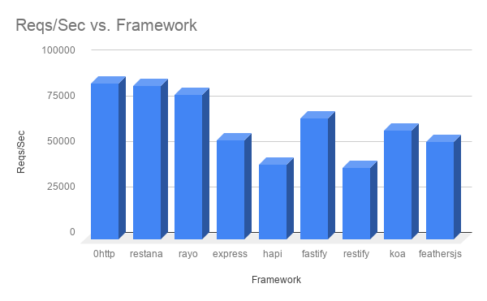

# Introduction
[](https://www.npmjs.com/package/0http)
[](https://www.npmjs.com/package/0http)
[](https://www.npmjs.com/package/0http)
[](https://www.npmjs.com/package/0http)
[](https://github.com/jkyberneees/0http)

<br/>
<div align="center">
  
  <br/>
  <br/>
  <b>Zero friction HTTP framework for Node.js</b>
  <br/>
  <i>Tweaked for high throughput, low overhead, and maximum flexibility.</i>
</div>
<br/>

## Why 0http?

- 🚀 **Blazing Fast**: One of the fastest Node.js web frameworks. Optimized for speed with smart caching and efficient routing.
- 🛠 **Highly Configurable**: Swap routers, servers, and customize behavior to fit your needs.
- 🔌 **Middleware Support**: Express-like middleware chain with full `async/await` support.
- ʦ **TypeScript Ready**: First-class TypeScript support for type-safe development.
- 🧩 **Nested Routing**: Powerful nested router support for modular architectures, optimized for static paths.
- 🛡️ **Production Ready**: Secure defaults with environment-aware error handling.

---

## Installation

```bash
npm install 0http
```

## Quick Start

### JavaScript

```js
const zero = require('0http')
const { router, server } = zero()

router.get('/hello', (req, res) => {
  res.end('Hello World!')
})

router.post('/do', (req, res) => {
  res.statusCode = 201
  res.end('Done!')
})

server.listen(3000, () => {
  console.log('Server listening on port 3000')
})
```

### TypeScript

```ts
import zero from '0http'
import { Protocol } from '0http/common'

const { router, server } = zero<Protocol.HTTP>()

router.use((req, res, next) => {
  console.log('Request received')
  return next()
})

router.get('/hi', (req, res) => {
  res.end('Hello World from TS!')
})

server.listen(3000)
```

---

## Core Capabilities

### 1. Pluggable Routers
`0http` allows you to define the router implementation you prefer.

#### Sequential Router (Default)
An extended implementation of [trouter](https://www.npmjs.com/package/trouter).
- **Features**: Middleware support, nested routers, regex matching.
- **Performance**: Uses an internal LRU cache (optional) to store matching results, making it extremely fast even with many routes.
- **Supported Verbs**: `GET, HEAD, PATCH, OPTIONS, CONNECT, DELETE, TRACE, POST, PUT`

```js
const sequential = require('0http/lib/router/sequential')
const { router } = zero({
  router: sequential({
    cacheSize: 2000 // Configurable cache size
  })
})
```

#### Find-My-Way Router
Integration with [find-my-way](https://github.com/delvedor/find-my-way), a super-fast Radix Tree router.
- **Best for**: Static paths and high performance without regex overhead.
- **Note**: Does not support all the middleware goodies of the sequential router.

```js
const { router } = zero({
  router: require('find-my-way')()
})
```

### 2. Middleware Engine
The middleware engine is optimized for performance and flexibility.

#### Global & Route Middleware
```js
// Global middleware
router.use('/', (req, res, next) => {
  res.setHeader('X-Powered-By', '0http')
  next()
})

// Route-specific middleware
const auth = (req, res, next) => {
  if (!req.headers.authorization) {
    res.statusCode = 401
    return res.end('Unauthorized')
  }
  next()
}

router.get('/protected', auth, (req, res) => {
  res.end('Secret Data')
})
```

#### Async/Await Support
Fully supports async middlewares for clean code.

```js
router.use('/', async (req, res, next) => {
  try {
    await next()
  } catch (err) {
    res.statusCode = 500
    res.end(err.message)
  }
})
```

### 3. Nested Routers
Organize your application with modular nested routers. `0http` optimizes static nested routes for better performance.

```js
const zero = require('0http')
const { router, server } = zero()

const v1 = require('0http/lib/router/sequential')()

v1.get('/users', (req, res) => res.end('User List'))
v1.get('/posts', (req, res) => res.end('Post List'))

// Mount the nested router
router.use('/api/v1', v1)

server.listen(3000)
```

### 4. Custom Servers
`0http` is server-agnostic. You can use the standard Node.js `http.Server`, `https.Server`, or even custom implementations.

```js
const https = require('https')
const fs = require('fs')
const zero = require('0http')

const options = {
  key: fs.readFileSync('key.pem'),
  cert: fs.readFileSync('cert.pem')
}

const { router, server } = zero({
  server: https.createServer(options)
})

server.listen(443)
```

---

## Configuration Options

Pass a configuration object to `zero(config)`:

| Option | Description | Default |
|--------|-------------|---------|
| `router` | Custom router instance. | `sequential()` |
| `server` | Custom server instance. | `http.createServer()` |
| `defaultRoute` | Handler for 404 Not Found. | `(req, res) => { res.statusCode = 404; res.end() }` |
| `errorHandler` | Global error handler. | Production-safe error handler (hides stack traces in prod). |
| `prioRequestsProcessing` | Use `setImmediate` to prioritize request processing. | `true` (for Node.js http/https) |

### Sequential Router Options
| Option | Description | Default |
|--------|-------------|---------|
| `cacheSize` | LRU cache size. `0` to disable, `<0` for unlimited. | `-1` (Unlimited) |

---

## Benchmarks



> **Note**: Benchmarks are subject to hardware and environment.
> Check the latest independent results: [Web Frameworks Benchmark](https://web-frameworks-benchmark.netlify.app/result?f=feathersjs,0http,koa,fastify,nestjs-express,express,sails,nestjs-fastify,restana)

**Snapshot (MacBook Pro i9, Node v12):**
- **0http (sequential)**: ~88k req/sec
- **0http (find-my-way)**: ~87k req/sec
- **restana**: ~73k req/sec

---

## Ecosystem

- **[low-http-server](https://github.com/jkyberneees/low-http-server)**: A low-level HTTP server implementation for extreme performance, originally part of 0http.

## Support

If you love this project, consider supporting its maintenance:
- **PayPal**: [Donate](https://www.paypal.me/kyberneees)

## License

MIT